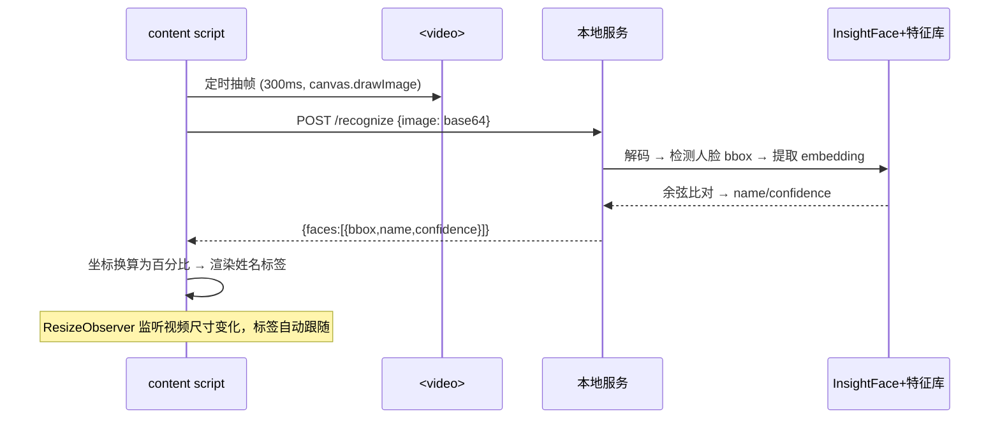

# B站视频明星人脸识别浏览器插件 —— 详细设计文档

> 配套需求文档：`Bface.md`（版本 1.0）  
> 本文档描述系统的总体设计、模块划分、接口协议、数据结构、性能/安全/测试设计，作为开发与论文撰写的依据。

---

## 1. 总体设计

### 1.1 设计目标与约束

| 维度 | 约束 |
|------|------|
| 功能 | B 站视频页面自动识别人脸并叠加显示明星姓名 |
| 性能 | 常规配置 PC（i5 / 8GB）CPU 占用 ≤ 30%，播放流畅 |
| 隐私 | 所有图像数据不离开用户设备（本地服务处理） |
| 兼容 | Chrome 88+，Windows / macOS |
| 范围 | MVP 仅支持 www.bilibili.com，明星库 100~500 人（本地固定库） |

### 1.2 架构决策：为什么是"浏览器插件 + 本地 Python 服务"双端

| 方案 | 优点 | 缺点 | 结论 |
|------|------|------|------|
| 纯浏览器端（TensorFlow.js / Wasm） | 免安装、免服务 | 模型精度/速度受限、打包体积大、部署复杂 | 不采用 |
| **插件 + 本地服务（本方案）** | 直接复用成熟 InsightFace 管线，精度高、开发快；隐私不妥协 | 需用户本地运行 Python 服务 | **采用** |
| 云端 API | 精度高、零本地依赖 | 视频帧上传有隐私与成本问题 | 不采用（与 NFR-3 冲突） |

### 1.3 系统架构图

```plaintext
┌──────────────────────────────┐         HTTP (JSON)          ┌──────────────────────────────┐
│      Chrome 插件 (前端)       │  ──── POST /recognize ────▶  │    本地识别服务 (Python)      │
│                              │  ── data:image/jpeg;base64 ── │                              │
│  · content script            │                               │  · Flask (threaded)          │
│    - 播放器探测 MutationObs.  │  ◀─── {faces:[{bbox,name}]} ─ │  · RetinaFace 检测           │
│    - canvas 抽帧 (960px)     │                               │  · ArcFace 512 维特征提取    │
│    - 轮询节流 / 同帧去重     │                               │  · 余弦相似度比对 (阈值0.6)  │
│    - 覆盖层渲染 (百分比定位)  │                               │  · 帧缓存 (内容哈希去重)     │
│  · popup 设置面板            │                               │                              │
│    - 开关/阈值/频率           │                               │          │ 读取              │
│    - 服务状态检测 (/health)   │                               │          ▼                   │
│  · service worker 角标       │                               │  ┌──────────────────────────┐│
└──────────────────────────────┘                               │  │ 明星特征库 star_features  ││
      chrome.storage.sync（配置持久化）                         │  │ .pkl {姓名: 512维向量}    ││
                                                               │  └──────────────────────────┘│
                                                               └──────────────────────────────┘
```

### 1.4 数据流（一次识别周期）



---

## 2. 前端插件详细设计（Chrome MV3）

### 2.1 manifest.json 关键声明

| 声明 | 值 | 用途 |
|------|-----|------|
| `manifest_version` | 3 | 使用 MV3 |
| `permissions` | `storage`, `tabs` | 配置持久化；popup 查询当前标签页 |
| `host_permissions` | `http://127.0.0.1/*`, `http://localhost/*` | 允许 content script 跨源访问本地服务（免 CORS 限制） |
| `content_scripts` | matches: `*://www.bilibili.com/*` | 注入 4 个 JS（config → frame-capture → overlay → content） |
| `action.default_popup` | `popup/popup.html` | 设置面板 |
| `background.service_worker` | `background/service-worker.js` | 服务状态角标 |

### 2.2 模块划分与职责

| 文件 | 职责 |
|------|------|
| `content/config.js` | 定义 `DEFAULT_CONFIG` / `CONFIG`，封装 `loadConfig()`（读 chrome.storage.sync）与 `listenConfigChange()`（监听配置变更并热更新） |
| `content/frame-capture.js` | `FrameCapture.findVideo()`：按优先级选择器探测 B 站播放器 `<video>`；`capture()`：canvas 抽帧 → 缩放至最大宽度 960px → JPEG base64 |
| `content/overlay.js` | `Overlay` 覆盖层：容器与视频父级对齐，标签用**百分比坐标**映射（天然适配缩放/全屏）；字号随视频宽度自适应；人脸贴近顶部时标签自动翻转入框内避免裁切 |
| `content/content.js` | 主控：播放器探测（MutationObserver + 兜底轮询）、识别主循环、请求节流、同帧去重、人脸平滑去抖（IoU 迟滞）、服务健康检测与 Toast 提示、消息处理 |
| `popup/popup.js` | 设置面板逻辑；`/health` 状态展示；`chrome.tabs.sendMessage` 获取页面运行状态 |
| `background/service-worker.js` | 接收 `SERVICE_STATUS` 消息，设置插件角标（断开显示红色 "!"） |

### 2.3 识别主循环（content.js）设计要点

```
每 intervalMs(默认300ms) 执行 tick():
  1. 开关关闭 / 页面隐藏 / 无视频 → 直接返回
  2. 视频 paused/ended → 清空覆盖层，返回（不空转）
  3. 上一请求未返回 (inFlight) → 跳过本次（节流）
  4. canvas 抽帧 → base64 末 64 字符与上帧相同 → 跳过（同帧去重）
  5. POST /recognize
  6. 成功 → 渲染（附平滑去抖）；失败 → 提示 + 清空覆盖层
```

**人脸平滑去抖**：前一帧已识别为已知明星、当前帧该位置闪成"未知"时，
用 IoU>0.5 的帧间匹配保持原姓名，抑制标签闪烁。

**坐标换算**：识别框坐标为捕获帧像素 → 除以帧宽高得百分比 →
覆盖层（与视频元素同尺寸）内用百分比定位。视频元素尺寸变化
（窗口缩放/全屏）由 `ResizeObserver` 触发容器重定位，无需重算。

### 2.4 服务状态机（前端视角）

```
未连接 ── /health 成功 ──▶ 已连接(显示入库明星数)
   ▲                          │
   └── 请求失败 / health 失败 ┴──▶ 显示"服务未连接"Toast，每5s自动重试
```

---

## 3. 后端服务详细设计（Python Flask）

### 3.1 目录与模块

| 文件 | 职责 |
|------|------|
| `config.py` | 集中配置：监听地址/端口、模型名与检测分辨率、Provider（CPU/GPU）、特征库路径、相似度阈值、最大人脸数、帧缓存大小 |
| `recognizer.py` | `FaceRecognizer` 类：模型加载（InsightFace `buffalo_l`，含 RetinaFace 检测 + ArcFace 识别）；特征库加载与归一化；`recognize()` 检测→比对→结果；`_match()` 余弦相似度；帧缓存（内容哈希去重，LRU） |
| `app.py` | Flask 应用：`/health`、`/recognize`；base64 解码；CORS 头；错误码约定 |
| `build_db.py` | 离线构建特征库：按姓名分组图片 → 提取每张最大人脸 embedding → 均值归一化 → pickle 保存 |
| `test_api.py` | unittest：health / 空图识别 / 参数错误 / 非法图像 / CORS 头 |

### 3.2 识别管线

```
POST /recognize
  → 校验 model_loaded，未加载返回 500 "Model not loaded"
  → 解析 JSON 取 image → base64 解码 → cv2.imdecode → BGR
  → 帧缓存命中？→ 直接返回缓存结果
  → face_app.get(img)  → 每张人脸: bbox + 512维 embedding
  → embedding 归一化 → 与特征库全量点积（余弦相似度）
  → 最高分 ≥ 阈值(0.6) → 该明星姓名；否则 "未知"
  → 返回 {faces:[{bbox, name, confidence}], processing_time}
```

**余弦相似度**：所有向量构建时即 L2 归一化，比对退化为点积，
`O(N)` 逐人扫描；N=500 时单帧比对耗时 < 1ms，瓶颈在检测。

### 3.3 并发与性能

- Flask `threaded=True`：多线程处理并发帧请求（插件单页默认串行，全屏双屏等场景受益）；
- 后端帧缓存：对 64×64 下采样图取 MD5 作键，命中即返回（暂停/静止帧零计算）；
- 前端节流 + 同帧去重，避免无效请求；
- 检测分辨率 640×640 与 CPU 占用/精度的平衡点可在 `config.py` 调整；
- GPU 可选：`PROVIDERS = ["CUDAExecutionProvider", "CPUExecutionProvider"]`。

### 3.4 模型与启动

- `insightface.app.FaceAnalysis(name="buffalo_l")` 首次运行自动从官方源下载模型
  （约 300MB，存于 `~/.insightface/models/`）；网络受限可手动放置；
- 模型加载失败**不崩溃**：服务照常启动，`/health` 返回 `model_loaded: false`，
  `/recognize` 返回 500，前端据此给出友好提示（对应 FR-9）；
- 特征库缺失同理：`/health` 中 `stars: 0`，所有人脸返回"未知"（对应 FR-8）。

---

## 4. 明星特征库设计

### 4.1 数据结构

```
star_features.pkl  (pickle, protocol=4)
└── dict
    ├── "周杰伦" : ndarray(512,) float32  # L2 归一化
    ├── "林俊杰" : ndarray(512,) float32
    └── ...
```

- 键：明星姓名（str，中文）；值：512 维归一化特征向量；
- 归一化在构建与加载时双重保证，比对直接用点积；
- 与识别模型同源（同一套 buffalo_l 提取），保证特征空间一致。

### 4.2 构建流程（build_db.py）

1. 遍历 `data/faces/<姓名>/` 每张图片；
2. 检测人脸，**取面积最大的一张**（合照取主体）；
3. 提取 embedding 并归一化；
4. 同一人多张图取**均值向量**再归一化（多角度融合，提升鲁棒性）；
5. 过滤：图片不足 3 张或未检测到人脸者跳过并提示；
6. 保存 pkl 并打印统计。

### 4.3 数据源与扩展

- MVP：104 位明星数据集（百度 AI Studio / GitHub）或自行收集每人 10~20 张；
- 扩展：CN-Celeb 筛选中国明星子集；特征库文件独立于插件，**重建文件即热更新**（NFR-4），
  服务重启时自动重载，无需重装插件。

---

## 5. 接口协议

### 5.1 GET /health

请求：无参数。

响应 `200 OK`：

```json
{
  "status": "ok",
  "model_loaded": true,
  "stars": 104,
  "threshold": 0.6,
  "version": "1.0.0"
}
```

### 5.2 POST /recognize

请求头：`Content-Type: application/json`  
请求体：

```json
{ "image": "data:image/jpeg;base64,/9j/4AAQ..." }
```

响应 `200 OK`：

```json
{
  "faces": [
    { "bbox": [100, 50, 200, 180], "name": "周杰伦", "confidence": 0.8214 }
  ],
  "processing_time": 0.21
}
```

说明：`bbox` 为 `[左, 上, 右, 下]` 像素坐标，相对**发送帧**的原始尺寸。

错误响应：

| 状态码 | 场景 | 响应体 |
|--------|------|--------|
| 400 | 缺少 `image` 字段 / 图像数据非法 | `{"error": "..."}` |
| 500 | 模型未加载 / 识别异常 | `{"error": "Model not loaded"}` 等 |

CORS：所有响应带 `Access-Control-Allow-Origin: *`（扩展来源访问需要）。

---

## 6. 性能设计（对照 NFR）

| 需求 | 设计对策 | 验证 |
|------|----------|------|
| ≥5fps 处理 | 前端节流+同帧去重+后端帧缓存；检测 640 分辨率；单帧比对 O(N) 点积 | 端到端计时 / processing_time 字段 |
| CPU ≤ 30% | 默认 300ms 采样、960px 帧宽、JPEG 0.7；页面隐藏/暂停零开销；仅画面变化才请求 | 任务管理器 10 分钟压测 |
| 内存稳定 | 帧缓存 LRU 上限 4 条；覆盖层标签逐帧重建不累积 | 长时间播放观察 |
| 标签不遮挡内容 | 标签置于人脸框上方，半透明小字号，顶部人脸自动翻转入框 | 全屏/多分辨率目测 |

> 注：≥5fps 为极限目标。CPU 推理单帧约 100~300ms（640 分辨率），
> 默认 300ms 采样约 3fps，已满足流畅观看；追求 5fps 可降分辨率/升采样或启用 GPU。

## 7. 安全与隐私设计（对照 NFR-3）

- 服务仅监听 `127.0.0.1`，不对外网开放端口；
- 帧数据只经本机回环传输，无任何外部网络请求（模型下载除外）；
- 插件仅声明 `storage` + `tabs` 权限，host_permissions 仅限本机回环地址；
- 特征库与照片仅存本地，不入库 Git。

## 8. 错误处理与降级

| 场景 | 表现 |
|------|------|
| 服务未启动 | 页面 Toast"识别服务未连接"，每 5s 自动重试；插件角标红色 "!" |
| 服务中途停止 | 同上自动重连；期间覆盖层清空，不影响视频播放 |
| 模型未加载 | `/health` 提示模型未就绪，popup 黄色警示 |
| 无人脸 / 未匹配 | 显示"未知"（可配置），不打扰观看 |
| 请求超时/异常 | 跳过该帧，下一采样周期重试 |
| B 站页面改版 | 选择器集中在 frame-capture.js，便于维护；兜底取页面首个 video |

## 9. 测试设计

### 9.1 单元/接口测试（自动化）

`python -m unittest test_api -v`：

- `/health` 返回 200 且含 `model_loaded`/`stars`；
- 纯色图：模型就绪 → 200 且 `faces: []`；模型未加载 → 500；
- 缺 `image` 字段 → 400；非法 base64 → 400；
- CORS 头存在。

### 9.2 端到端测试（人工，对照 Bface.md §5）

| 用例 | 预期 |
|------|------|
| 播放含已入库明星的视频 | 正确显示姓名标签 |
| 播放无明星/未入库视频 | 不显示或显示"未知" |
| 多人同框 | 每人一个标签 |
| 1080p 播放 10 分钟 | CPU ≤ 30%，无内存增长 |
| 全屏/切分辨率/缩放窗口 | 标签位置跟随视频不错位 |
| 未启动服务 / 中途关闭服务 | 提示"服务未连接"，不崩溃，恢复后自动重连 |

## 10. 风险与应对

| 风险 | 应对 |
|------|------|
| 数据集角度单一致准确率低 | 每人多角度照片、均值融合；调低阈值；后续数据增强 |
| B 站 DOM 改版 | 选择器集中管理；兜底"页面首个 video"；文档化手动配置 |
| 本地服务安装复杂 | 一键启动脚本（bat/sh）；`check_env.py` 自检；插件内服务状态引导 |
| CPU 性能不足 | 调采样间隔、降检测分辨率、画面变化触发识别、GPU 可选 |
| 隐私顾虑 | 全本地处理，README/插件描述明确承诺 |

## 11. 后续扩展方向

- 特征库热更新 API（`POST /reload`）与 CN-Celeb 大库；
- 场景变化触发（相邻帧差异阈值）替代固定轮询，省 70%+ 计算；
- onnxruntime CUDA 加速实现稳定 ≥5fps；
- 多视频网站支持（配置化选择器）；
- 打包 crx 并上架商店，交付一键安装版（含 Python 内嵌运行时的免 Python 安装包）。
